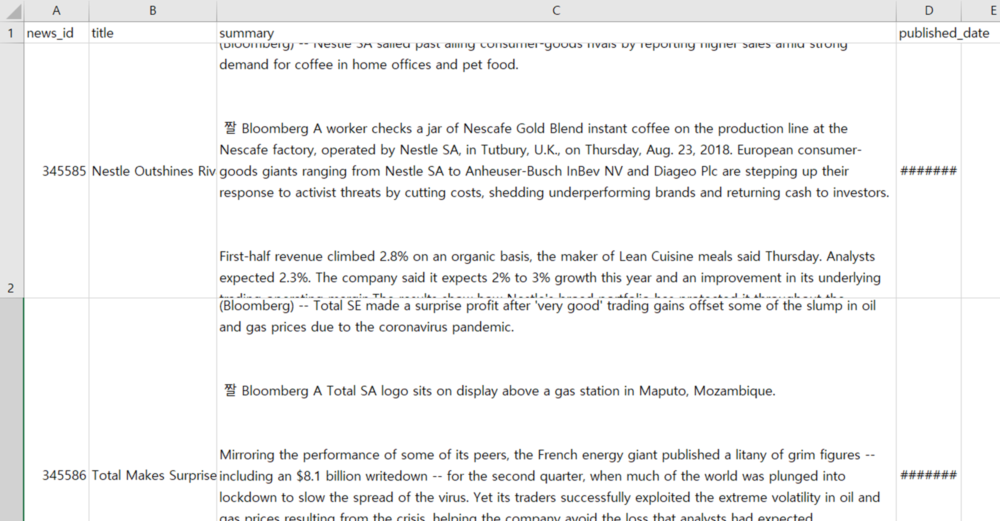
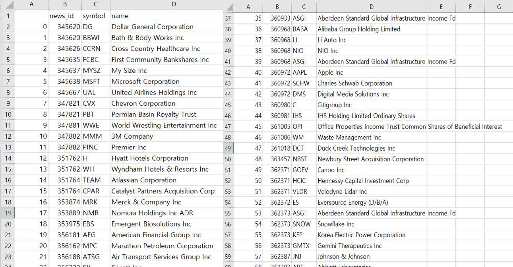

# intern_project2

- 뉴스 원문을 이용한 해외종목 코드 맵핑

뉴스 원문 csv

News_raw 데이터  
-> 회사 이름 추출  
-> 뉴스 내용에 대한 키워드 추출 (keyBert 패키지 사용)

Ticker 정보 데이터 수집  
-> yfinance 패키지 사용

News_raw => WordNetLemmatizer 패키지 사용 ( 단복수 처리 )  
-> 종목명의 대표 키워드  
( news_raw에서 추출된 종목명의 키워드들 모아서 빈도수 높은 단어들 ) 추출

매핑 방법 1) 종목명의 대표키워드( 5개 )가 뉴스 원문에 포함이 될 경우  
매핑 방법 2) 종목명의 대표키워드( 5개 )와 뉴스 원문의 대표키워드( 10개 )의 교집합이 4 이상일 경우

( 데이터가 크기 때문에 ) 뉴스 원문 1000개로만 테스트  
뉴스 원문 2000개에서 종목명의 대표키워드를 뽑은 후 뉴스 원문 1000개와 매핑  
( 뉴스 원문에서 도출된 키워드들을 모아서 대표키워드를 뽑는 것이기 때문에 뉴스 원문의 데이터 많을수록 대표키워드의 정확도 † )

뉴스원문과 종목명 매핑 결과 csv

총 매핑 수 : 1534  
제대로 매핑된 수 : 1077  
잘못 매핑된 수 : 457  
정확도 : 70.2 % 
